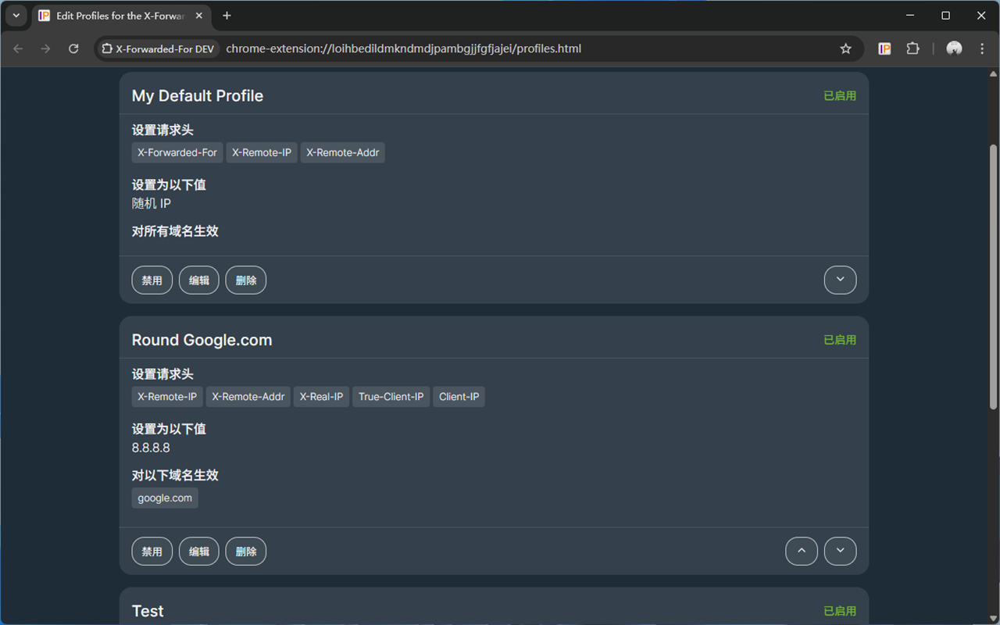
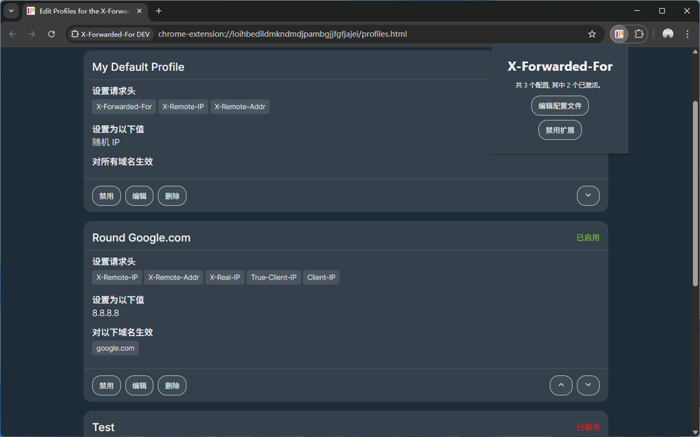
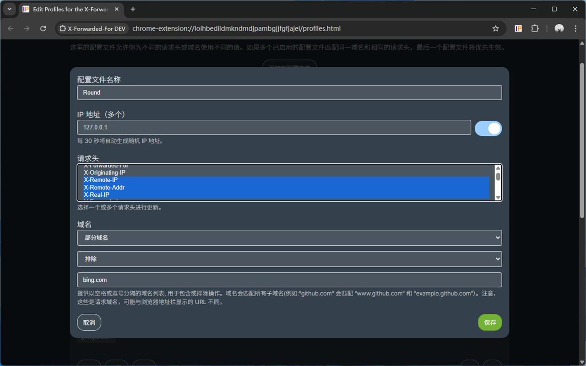

# enhance-x-forwarded-for

[X-Forwarded-For](https://github.com/MisterPhilip/x-forwarded-for) Modified edition







### Get it

Chrome [releases](https://github.com/fany0r/enhance-x-forwarded-for/releases)

Microsoft Edge [this](https://microsoftedge.microsoft.com/addons/detail/xforwardedfor-header/fjjjpjleokdnichiamombahbepijjbhf) 

Firefox [this](https://addons.mozilla.org/firefox/addon/x-forwarded-for-header-injecto/)

### Local Build

```bash
git clone https://github.com/fany0r/enhance-x-forwarded-for.git
cd enhance-x-forwarded-for
npm instal
npm run build
```
